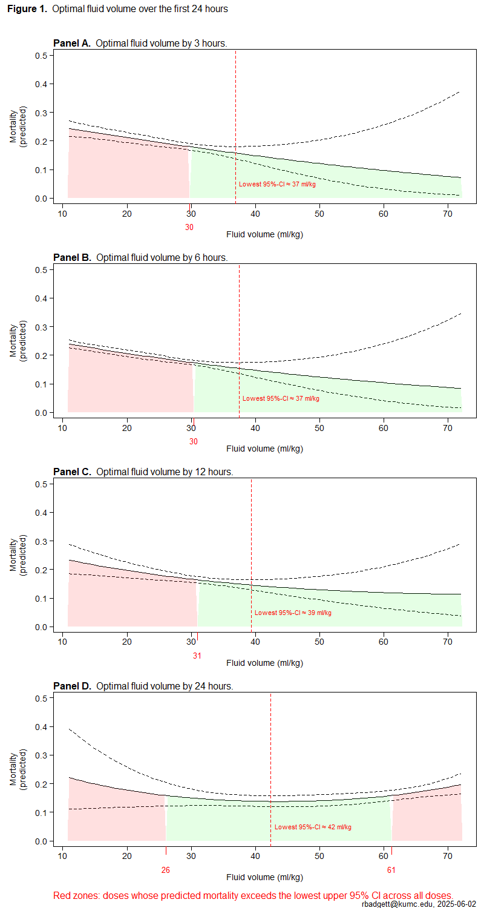

Sepsis fluids and timing - dose-response meta-analysis
============================================
A living systematic review

(this meta-analysis is in the exploratory state; formal lit search has not been started)

Short url: http://openmetaanalysis.github.io/Sepsis-fluids_and_timing_-_dose-response_meta-analysis

**Clinical summary:** 
This meta-analysis suggests that the optimal dosing of fluids is:
* Give at least 30 ml/kg by hour three for the typical patient
* Avoid over 60 ml /kg within the first 24 hours. Optimal is about 40 ml/kg for the typical patient.
<!--
effectiveness of the clinical intervention *is* [moderate](https://training.cochrane.org/handbook/current/chapter-15#section-15-5-3-1). [Standarized mean differences](https://training.cochrane.org/handbook/current/chapter-15#section-15-3) betweeen intervention and control groups across outcomes range from x to y. 

Heterogeneity of results as measured by I2 '[might not be important](https://training.cochrane.org/handbook/current/chapter-10#section-10-10-2)' at x% for all analyses; however very wide confidence intervals reflect the small number of studies and subjects. 

Meta-regression of common modulators (year of publication, study size, event rate in the control groups) has not been done due to the small number of studies.
-->
This review updates previously published meta-analysis(es).(citation[s] below)

* [Reconciliation of studies and conclusions with prior meta-analyses](files/reconciliation-tables/Reconciliation%20of%20studies%20and%20conclusions.pdf)
* [Keep current with this topic](files/searching/Keep-up.md)

Acknowledgement: we acknowledge the essential work by the authors of the prior [systematic review(s)](#systematic-reviews) listed below.

**Methods overview:** This repository is an [openMetaAnalysis](https://openmetaanalysis.github.io/) that combines methods of scoping, rapid, and living systematic reviews.  This analysis updates one or more previously published review(s) below. A comparison of studies included in this review compared to prior reviews are in the table, [reconciliation of trials included with prior meta-analyses/](files/reconciliation-tables/Reconciliation%20of%20studies.pdf). Newer studies included are listed in the references below. Rationale for newer trials excluded may be listed at the end of the references. 
* [Methods](http://openmetaanalysis.github.io/methods.html) for openMetaAnalysis
* [Evidence search](files/searching/evidence-search.md) for this review (under construction)

**Results:** Details of the studies included are in the (all pending):
* [Forest plots](../master/files/forest-plots)
* [spreadsheets with source data](files/data)
* [R code](files/code)
<!--
* [Reconciliation of studies and conclusions with prior meta-analyses](files/reconciliation-tables/Reconciliation%20of%20studies%20and%20conclusions.pdf) (under construction)
* [Description of studies (PICO table)](files/study-details/table-pico.pdf) (under construction)
* [Risk of bias assessment](files/study-details/table-bias.pdf) (under construction)
* [Network plots](../master/files/network) (optional)
-->

The forest plot for the primary outcomes are below. Additional [forest plots](files/forest-plots) of secondary analyses may be available. 

<!--
The meta-regression for the primary outcomes are below. Additional [meta-regressions](files/metaregression) of secondary analyses may be available. 

The GRADE Profile is below. 
-->
References:
----------------------------------

### Systematic review(s)
#### Most recent review at time of last revision of this repository
1. Ward MA, Kuttab HI, Badgett RG. The Effect of Early Fluid Resuscitation on Mortality in Sepsis: A Systematic Review and Meta-Analysis. Crit Care Med. 2025 Jul 10. doi: [10.1097/CCM.0000000000006769](http://dx.doi.org/10.1097/CCM.0000000000006769). Epub ahead of print. PMID: [40637496](http://pubmed.gov/40637496).

### Randomized controlled trials or cohort studies
#### New trial(s) *not* included in the most recent review above
Pending

#### Trial(s) included in the review above
Pending

#### Trial(s) undergoing review
Pending

#### Trial(s) excluded - selected list of important trial(s)
Pending

#### Cited by
This repository is cited by:

1. WikiDoc contributors. Pending content page. WikiDoc. Nov 9, 2014. Available at: http://www.wikidoc.org/index.php/This_topic. Accessed November 9, 2014. 

-------------------------------
[Cite and use this content](https://github.com/openMetaAnalysis/openMetaAnalysis.github.io/blob/master/reusing.MD)  - [Edit this page](../../edit/master/README.md) - [License](files/LICENSE.md) - [History](../../commits/master/README.md)  - 
[Issues and comments](../../issues?q=is%3Aboth+is%3Aissue)

